My Fedora and hyprland config and random scripts

## Software Used

### Base

| Type              | Name                                         |
| ----------------- | -------------------------------------------- |
| OS                | [Fedora](https://fedoraproject.org/)         |
| Window Compositor | [Hyprland](https://hyprland.org/)            |
| Bar               | [Waybar](https://github.com/Alexays/Waybar)  |
| Terminal          | [Kitty](https://github.com/kovidgoyal/kitty) |
| Shell             | fish                                         |

### Utilities

| Type                | Name                                                                             |
| ------------------- | -------------------------------------------------------------------------------- |
| Text Editor         | [Neovim](https://neovim.io/)                                                     |
| Wallpaper Backend   | [SWWW](https://github.com/LGFae/swww)                                            |
| Apps Launcher       | [Rofi](https://github.com/davatorium/rofi)                                       |
| System Info         | [Fastfetch](https://github.com/fastfetch-cli/fastfetch)                          |
| Notification Daemon | [Sway Notification Center](https://github.com/ErikReider/SwayNotificationCenter) |
| Lockscreen App      | [Hyprlock](https://github.com/hyprwm/hyprlock)                                   |
| Idle Daemon         | [Hypridle](https://github.com/hyprwm/hypridle)                                   |

## Screenshots

### Home

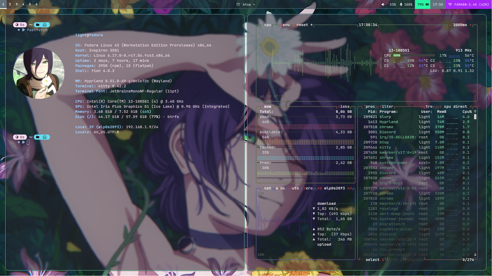

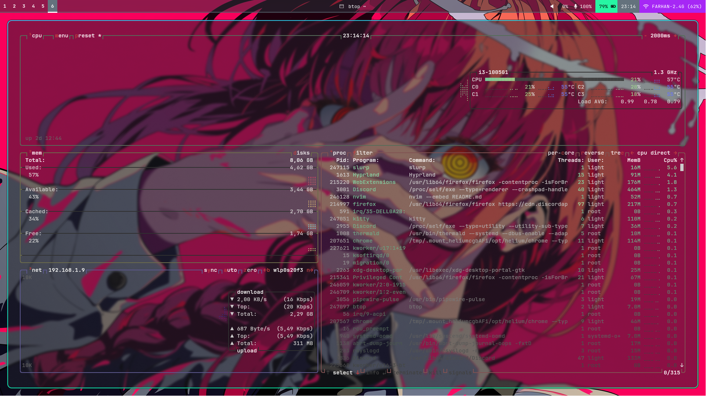

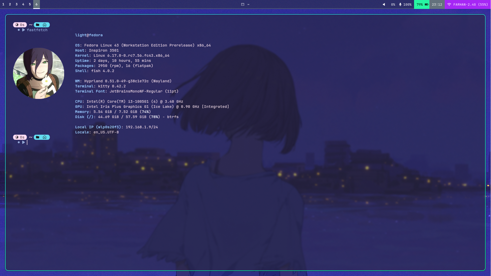

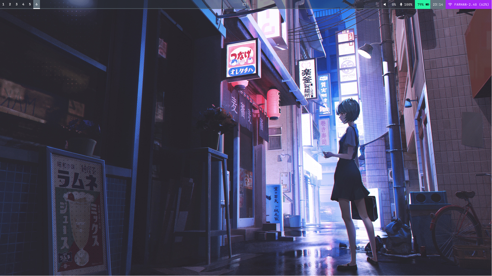

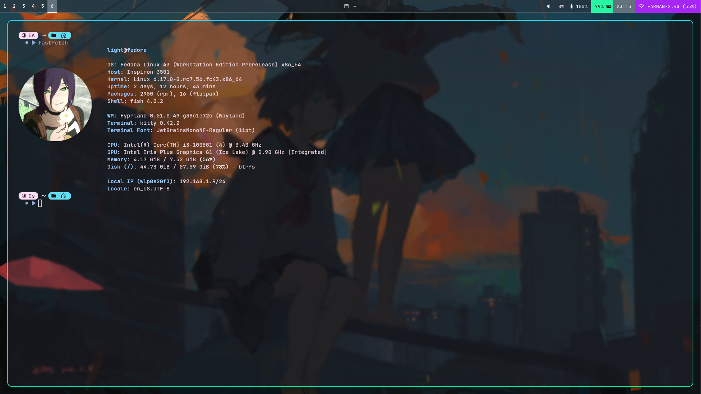

### Neovim

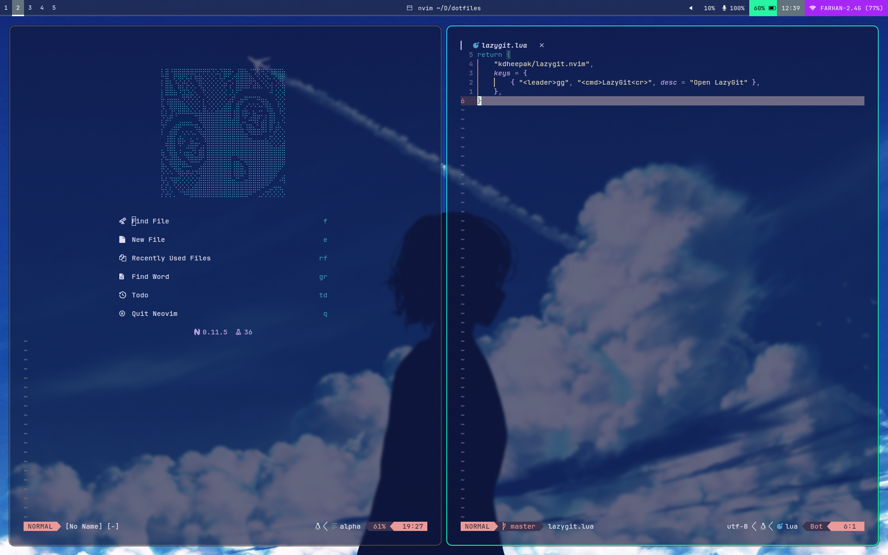

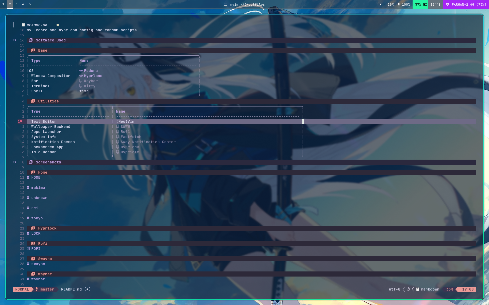

### Hyprlock

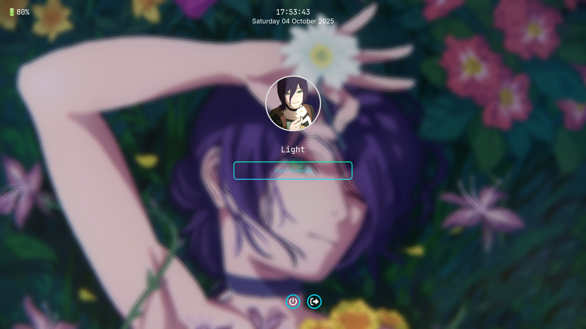

### Rofi

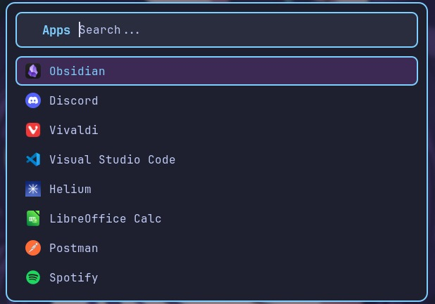

### Swaync

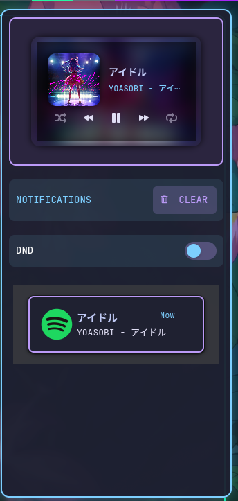

### Waybar

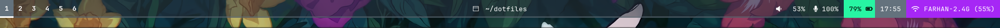

## Credits

- [adi1090x](https://github.com/adi1090x) for rofi inspiration
- [end-4](https://github.com/end-4/dots-hyprland) for kitty theme and keybinds
